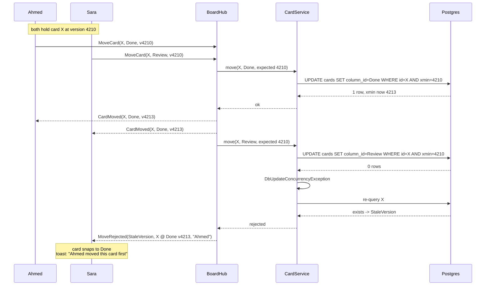
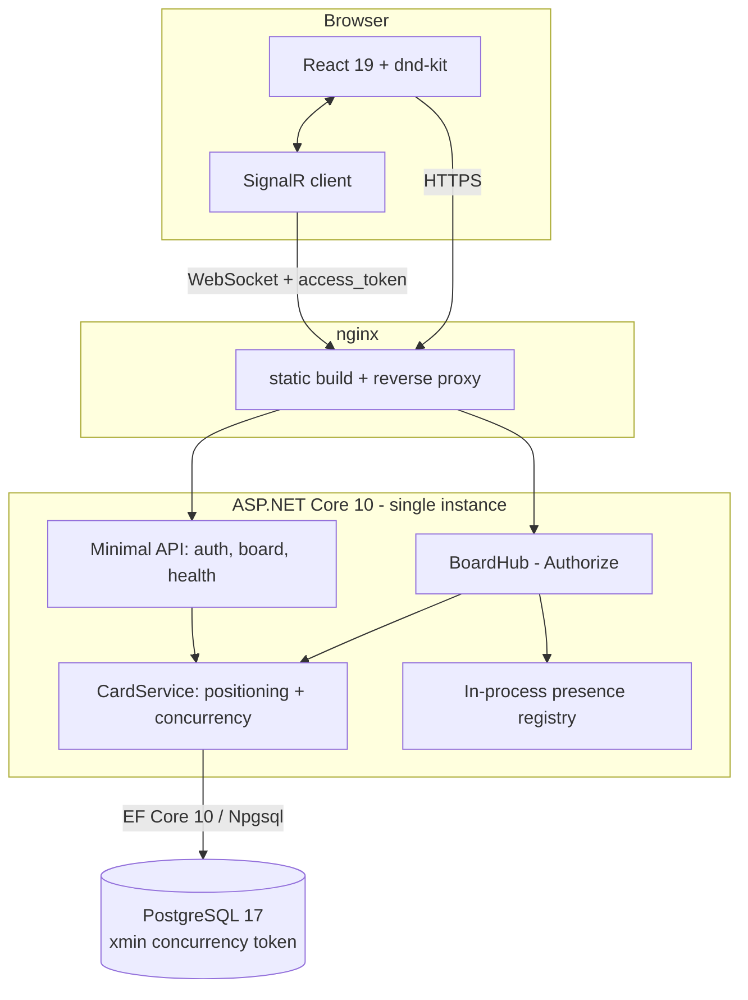
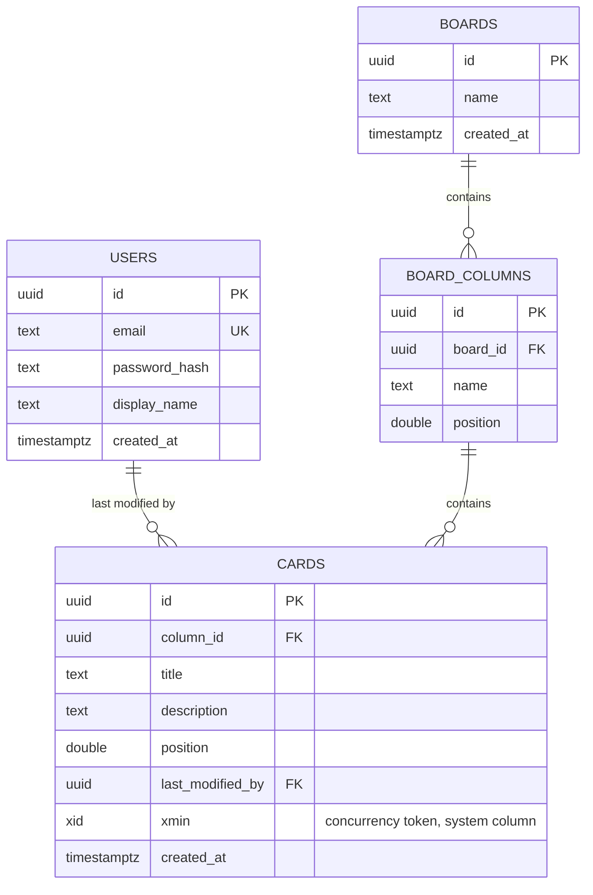

# BoardSync

A single-board collaborative kanban app. Several people work the same board at once and see each other's changes immediately: drag a card from **In Progress** to **Done** and everyone else's screen updates within a moment, no refresh. A presence list shows who is currently connected.

The kanban features are deliberately narrow. The real-time layer underneath is the product, and specifically how it behaves when two people write to the same card at the same instant.

> **Status: in development.** The sections below describe the design. Nothing is built yet. This notice comes down when there is a deployed URL.

---

## The interesting part: what happens when two people drag the same card

Two people grab the same card at the same moment and drop it in different columns. A naive implementation lets the last write win silently: one person's action vanishes with no feedback, and the two screens now disagree about reality with nothing to resolve them.

BoardSync uses **optimistic concurrency** instead. Every card carries a version token, the client echoes it back with every move, and a move whose version no longer matches the database is rejected rather than applied. The losing client is pushed the authoritative card state, its UI snaps to the truth, and a toast tells the user what actually happened.



Three details this design gets right that a first attempt usually does not:

- **Postgres has no `rowversion`.** SQL Server does; the Postgres equivalent is the `xmin` system column, the id of the transaction that last wrote the row. It is mapped as an EF Core concurrency token.
- **Zero rows affected is ambiguous.** It means either "someone moved it first" or "someone deleted it mid-drag," and those need opposite responses from the client. Conflating them is how the loser of a delete race watches a card resurrect itself.
- **The race is not reproducible by hand.** Because every change broadcasts, the genuine conflict window is one network round-trip wide. A deterministic integration test forces the interleaving, and a dev-only latency toggle widens the window so the conflict can be demonstrated live.

This is proven end to end, not just at the integration level: [`client/e2e/concurrency-race.spec.ts`](client/e2e/concurrency-race.spec.ts) drives two real Playwright browser contexts through this exact scenario and asserts one wins and the other snaps back with the toast.


A full write-up lives in [`docs/`](docs/) once the project ships.

---

## Architecture



A REST layer handles register, login, and health. Everything live after page load goes over a SignalR hub. On connect the client joins a group named for the board, so broadcasts reach only people actually viewing it rather than every connected socket.

All card mutation logic lives in `CardService` rather than in the hub. That boundary exists so the concurrency behavior can be tested by racing two `DbContext` instances directly, with no SignalR in the loop.

---

## Data model

Four tables, kept intentionally small.



**Card ordering** uses fractional positions: dropping between two cards sets the new position to the midpoint of its neighbours, and a column renormalizes to evenly spaced values when the gap gets too small.

This matters more than it looks. If a move renumbered the whole column, every concurrent move within that column would touch every row and conflict, and the concurrency story would degrade into a stream of false conflicts that have nothing to do with users actually contending for a card. Fractional positioning keeps a normal move to a **single-row UPDATE**, so a conflict means two people really did fight over one card.

The client sends the drop as neighbour ids rather than a computed number, and the server resolves the position against current database state. A client-computed position is derived from neighbours the client may have stale knowledge of, which is the same argument that motivates the concurrency token in the first place.

---

## Stack

| Layer | Choice |
|---|---|
| Runtime | .NET 10 (LTS) |
| API | ASP.NET Core Minimal APIs + SignalR |
| ORM | EF Core 10 with Npgsql |
| Database | PostgreSQL 17 |
| Client | React 19 + TypeScript, Vite |
| Drag and drop | `@dnd-kit/core`, `@dnd-kit/sortable` |
| Real-time client | `@microsoft/signalr` |
| UI | Plain CSS Modules with a shared token file, `lucide-react` icons (Notion-style, no component-library dependency) |
| Tests | xUnit + Testcontainers, Vitest, Playwright |

---

## Running it

```bash
docker compose up
```

Brings up Postgres, the API, and the client in one command. Full prerequisites, environment variables, and native (non-Docker) instructions live in [`SETUP.md`](SETUP.md).

To run the two-browser concurrency race end to end (requires the stack above to already be running):

```bash
./scripts/run-e2e.sh
```

---

## Deliberately out of scope

Cutting these is what makes the build realistic. Each is a decision, not an omission.

- **No Redis backplane.** One server instance is plenty for a demo. SignalR groups and the presence roster are in-process, so a second instance would silently break both: broadcasts would reach only the clients connected to the same instance, and the presence roster would show a partial list. Scaling out would mean adding a Redis backplane so instances relay group messages to each other, and moving presence into shared state rather than process memory. That paragraph is a better signal than half-built infrastructure.
- **No per-board authorization.** There is one seeded board and any authenticated user may access it. `CardService` takes the board id as a parameter specifically so the ownership check has one obvious place to go.
- **JWT in the WebSocket query string.** Browsers cannot set custom headers on a WebSocket handshake, so the token is passed as `?access_token=` and read via `JwtBearerOptions.Events.OnMessageReceived`, restricted to the hub path. Query strings can land in proxy access logs; the production answer is a short-lived single-use ticket exchanged for the connection, which is out of scope here.
- No multi-board management, assignees, comments, labels, or due dates.
- No password reset, email verification, or refresh tokens.
- No mobile or touch drag support.
